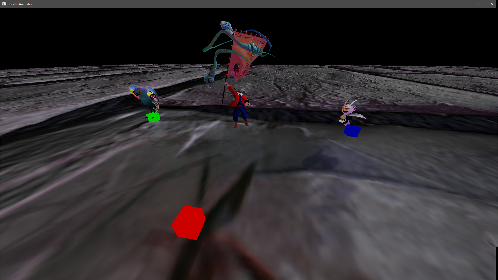

# Skeletal-Animation-Engine
A C++/OpenGL engine from scratch with skeletal animations and other features

This is a 3D rendering engine using C++ and OpenGL from scratch that I built for the 3D Animation and Visualization class in Instituto Superior Técnico.

It features:
- Skeletal animation
- Model loading and animation loading using ASSIMP
- Deferred shading
- Normal mapping
- Shadows
- Post processing using render targets

|[Animations and Shadows]](./Screenshots/Engine/Compressed Anim.mp4)

This engine was later used for the class' final project "Mega Unemployed Plumber Universe".